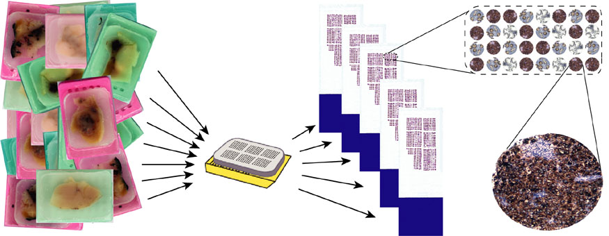
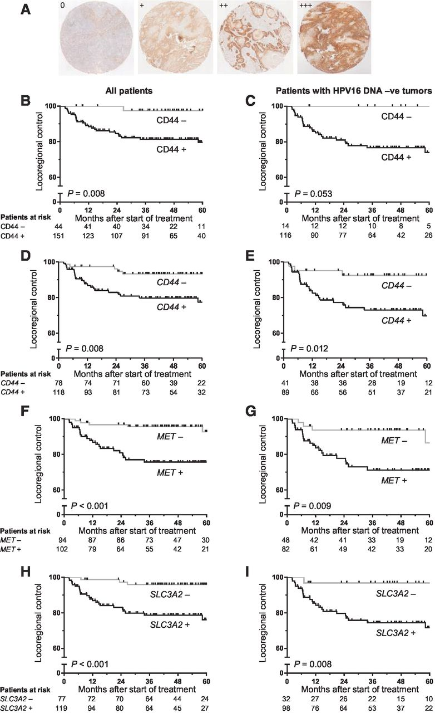

# Material und Methoden

## Studiendesign

Diskussion des Studiendesigns

Für die erfolgreiche Durchführung von Biomarker‑Studien sind ausreichend große Kohorten erforderlich, die nach aktuellen Therapierichtlinien behandelt wurden. Multizentrische (national/international) Studien erhöhen die Rekrutierungsrate und reduzieren Einzelzentrumseffekte sowie andere Bias‑Quellen, sodass retrospektive Daten näher am aktuellen Versorgungsstandard liegen.

Das Deutsche Konsortium für Translationale Krebsforschung (DKTK) ist ein nationales Forschungsnetzwerk, das im Oktober 2012 gegründet wurde ([Joos et al., 2019](about:blank#_ENREF_41)). In der Radioonkologie-Gruppe des DKTK (DKTK-ROG) sind alle 8 Partnerstandorte des DKTK organisiert. Im Rahmen der ersten gemeinsamen Studie der DKTK-ROG, sollen prognostische und prädiktive Biomarker für die lokoregionäre Kontrolle nach primärer bzw. nach postoperativer Radiochemotherapie in Patienten mit lokoregionären fortgeschrittenen Kopf-Hals-Plattenepithelkarzinom zunächst im retrospektiven Teil der Studie identifiziert, in dem prospektiven Studienteil validiert und in einer Interventionsstudie angewendet werden. Mittelfristiges Ziel des Gesamtprojektes ist die Etablierung von Markern, die nach prospektiver Validierung geeignet sind, als Grundlage individualisierter Therapieentscheidungen zu dienen. Ein aus den Studienleitern der jeweiligen Standorte gebildeter Lenkungsausschuss und die gemeinsame Co-Ownerschaft stellen den hohen Standard der Studie sicher. Die Studie wird durch die DKTK-ROG-Studienzentrale in Dresden betreut.

Die in dieser Arbeit vorgestellten Ergebnisse sind Teil der retrospektiven Untersuchung der multizentrischen Studie, in der immunhistochemisch messbare Biomarker für den Stammzellgehalt von Kopf-Hals-Plattenepithelkarzinomen angefärbt und evaluiert wurden. Anschließend erfolgte die Korrelation mit den klinischen Ergebnissen der postoperativen Radiochemotherapie.

## Patientenkollektiv und Tumormaterial

Das Patientenkollektiv bestand aus 221 Patienten mit lokal fortgeschritten Plattenepithelkarzinom des Kopf-Hals-Bereichs, die im Zeitraum zwischen 2004 und 2012 in den 8 Partnerzentren des Deutschen Konsortiums für Translationale Krebsforschung (DKTK) behandelt wurden. Die Ethikkommissionen aller DKTK-Partnerstandorte haben die ethische Genehmigung für multizentrische retrospektive Analysen klinischer und biologischer Daten eingeholt (AZ EK299092012).

Einschlusskriterien waren ein histologisch gesichertes Plattenepithelkarzinom der Mundhöhle, des Oro- oder Hypopharynx. Alle Patienten hatten nach der primären onkologischen Tumorresektion aufgrund des hohen Rezidivrisikos (Tumorstadium pT4 und/oder mikroskopischer Tumorrest nach Operation und/oder kapselüberschreitendes Wachstum der Lymphknotenmetastasen oder >3 Lymphknotenmetastasen) an einem der 8 Partnerstandorte des DKTK eine postoperative Cisplatin-basierte Radiochemotherapie (PORT-C) gemäß Standardprotokolle in kurativer Intension erhalten. Darüber hinaus war für den Studieneinschluss, neben klinischen Parametern unter anderem auch das Vorhandensein von FFPE-Tumormaterial (vor jeder tumorspezifischen Behandlung), Bestrahlungspläne sowie die Daten des klinischem follow-up mit Bildgebung / bildgebender Diagnostik (CT-, MRT- oder PET-CT) zur späteren Lage-Beurteilung eines möglichen Tumorrezidivs verpflichtend und wurden zentral am DKTK-Standort Dresden gesammelt ([Lohaus et al., 2014](about:blank#_ENREF_52)). Die analysierten Gewebeproben entstammten überwiegend aus Primärresektaten, wobei im Falle von fehlendem Primärtumorresektaten in wenigen Fällen auf Tumorbiopsien, die im Rahmen einer diagnostischen Planendoskopie entnommen wurden, oder Lymphknotenmetastasen zurückgegriffen wurde. Die Mindestnachbeobachtungszeit musste 24 Monate betragen (Letzte Rekrutierung 2010). Der Raucherstatus und Alkoholkonsum wurden nicht für alle Patienten konsistent aufgezeichnet und konnten daher nicht analysiert werden. Alle Einschlusskriterien sind in Tabelle 4‑1 nochmals übersichtlich dargestellt. Die Patientenmerkmale sind in der Tabelle 5‑1 dargestellt.

Tabelle 4‑1: Einschlusskriterien für Patienten

| Einschlusskriterien für Patienten |  |
| --- | --- |
| Histologie | Plattenepithelkarzinom |
| Tumorlokalisation | Mundhöhle / Oropharynx / Hypopharynx |
| Behandlungszeitraum | 2004–2012 |
| Therapie | Postoperative cisplatin‑basierte Radiochemotherapie (kurativ) |
| Follow‑up | ≥24 Monate |
| Biomaterial | FFPE‑Tumormaterial |
| Ergänzende Daten | Bestrahlungspläne; CT/MRT/PET‑CT |

Nachträglich wurden 26 Patienten aufgrund von unzureichendem Biomaterial oder Nichterfüllen der Einschlusskriterien ausgeschlossen. Folglich waren für das vorliegender Projekt 195 in Formalin fixierte und in Paraffin eingebettete (FFPE) Operationspräparate verfügbar die nach standardisierten Verfahren am DKTK-Partnerstandort Dresden verarbeitet wurden und für die Biomarkeranalyse zur Verfügung standen.

## Immunhistologische Analysen

### Tissue-Microarray

Die Tissue-Microarray Technik wurde erstmals 1998 beschrieben ([Kononen et al., 1998](about:blank#_ENREF_46)) und ermöglicht eine effiziente und auf den Tumor fokussierte simultane Auswertung der einzelnen Gewebeproben. Die Methode hat seither die Art und Weise wie gewebebasierte Forschung, insbesondere im onkologischen Bereich stattfindet maßgeblich geprägt. Die TMA-Technik ermöglicht es, Gewebsproben verschiedener Patienten bzw. verschiedene Gewebeproben eines Patienten hinsichtlich ihrer immunhistochemischen Proteinexpression simultan und unter gleichen methodischen Bedingungen standardisiert zu untersuchen. Ein TMA-Block kann bis zu 150 - 200 zylindrisches Probematerial von verschiedenen Patienten mit einem Durchmesser von jeweils 0,6 – 1,0 mm enthalten. Die Gewebezylinder werden mit einer Hohlnadel aus einem vorher ausgewählten repräsentativen Bereich eines Spender-Paraffinblocks entnommen und danach in vorgefertigte Löcher in einem ursprünglich leeren Empfänger-Paraffinblock eingebracht.

*Herstellung der Referenzschnitte (HE-Färbung)*

Um das Vorhandensein eines Plattenepithelkarzinoms histologisch zu bestätigen und um repräsentative Tumorregionen im FFPE-Material für die zu untersuchenden Stanzungen zu definieren, wurden für alle FFPE-Tumorproben des Kollektivs zunächst Objektträger mit Gewebeschnitten in Hämatoxylin- und Eosinfärbung (HE-Färbung) angefertigt. Dabei wurden je 3 μm Schnitte der 195 zu untersuchenden FFPE-Blöcke mit einem Mikrotom angefertigt und auf Glasobjektträger aufgezogen und anschließend 24 Stunden bei Raumtemperatur getrocknet. Danach wurden die Schnitte in einer absteigenden Alkoholreihe deparaffiniert (Xylol, Propanol, Ethanol 96%, Ethanol 70%, Aqua dest.) und in TRIS-Puffer gewaschen. Nach der Inkubation mit Hämatoxylin und anschließendem Waschen mit Leitungswasser wurden die Schnitte mit Eosin inkubiert. Durch eine aufsteigende Alkoholreihe erfolgte die Entwässerung. Zum Schluss wurden die Schnitte mit Deckgläsern versehen. Diese Referenzschnitte wurden histologisch beurteilt und die repräsentativen Tumorregionen markiert (HNSCC, Lymphknoten Gewebe und normales Plattenepithel der Kopf-Hals Bereiches). Anschließend erfolgte die Übertragung der Markierung auf die (Spender-) Paraffinblöcke.

*Herstellung der Tissue Microarray Blöcke für die Biomarkeranalyse*

Nachdem die mikroskopisch repräsentativen Bereiche der in Paraffin eingebetteten Operationsresektate entsprechend der HE-Referenzpräparate auf dem Spender-Block übertragen wurden, erfolgte die Anfertigung von Gewebe-Mikroarrays (tissue micro arrays, TMA). Dazu wurden mit einem semiautomatischen Gewebe-Mikro-Arrayer (MiniCore®, Alphelys) 1 mm dicke Gewebezylinder über eine Hohlnadel aus vorher ausgewählten repräsentativen Tumorarealen im Spenderblock ausgestanzt. Diese Gewebezylinder wurden in leere Stanzlöcher eines Empfängerblocks überführt. Idealerweise wurden je Fall drei Stanzzylinder entnommen, um die Heterogenität innerhalb des Tumors zu berücksichtigen. Somit war es möglich pro Trägerblock bis zu 112 Stanzen einzubringen. Durch Erhitzung auf 60°C über 5 Minuten konnte ein Verbund des Träger- und Gewebeparaffins erreicht werden. Die Anordnung der Stanzzylinder im Empfängerblock erfolgte über einen zuvor definierten Lageplan, der für die spätere Auswertung eine eindeutige Zuordnung zum pseudonymisierten Patienten gewährleistet. In Abbildung sind der Aufbau und das Prinzip der TMA-Technik sowie der Dokumentation beispielhaft dargestellt.

Abbildung 4‑1: Aufbau der Tissue Microarray-Technik sowie Prinzip der Ortsdokumentation der einzelnen Tumor-Spots

### Immunhistologische Reaktionen

Die immunhistologische Färbereaktion wurde nach der indirekten Avidin-Biotin-Komplex- (ABC)-Methode durchgeführt.

Für die immunhistochemische Färbung wurden von jedem TMA-Block jeweils 3 μm dicke Schnitte angefertigt. Diese wurden in Xylol entparaffiniert und anschließend in einer absteigenden Alkoholreihe rehydriert. Für die anschließende Demaskierung der Primärantikörper-Bindungsstellen wurden die Objektträger in Zitratpuffer (pH 6; Dako) für 35 min bei 650W in einer Mikrowelle erhitzt und nach dem Abkühlen mit Waschpuffer gespült. Anschließend erfolgte die Blockierung der endogenen Peroxidaseaktivität (DAKO RealTM Peroxidase Blocking Solution; 10 min). Die TMA-Schnitte wurden mit dem monoklonalen Primärantikörper *Maus anti-human CD44-Antikörper* (Clone DF 1485; Verdünnung 1:100; Dako) für eine Stunde bei Raumtemperatur in einer feuchten Kammer inkubiert. Die Negativkontrolle wurde entsprechend mit IgG1-Kontrollreagenz (Mouse IgG1; Dako) inkubiert. Nach Zugabe des Visualisierungs-reagenz (Dako REAL EnVision) und anschließender Spülung der Objektträger mit Waschpuffer ergab sich die Farbreaktion durch Zugabe von DAB-Chromogenlösung entsprechend der Antigenverteilung im Gewebe. Die Gegenfärbung der Schnitte erfolgte mit Hämalaun (nach Mayer). Abschließend wurden die gefärbten Schnitte in aufsteigenden Alkohollösungen und Xylol dehydriert und mit Eukitt eingedeckelt.

### Appendix: Antibody / IHC assay details (stub)

| Antigen | Antikörper (Clone) | Verdünnung | Antigen‑Retrieval | Hersteller (Vendor) | Losnummer (Lot) |
| --- | --- | ---: | --- | --- | --- |
| CD44 | Mouse anti‑human CD44 (DF 1485) | 1:100 | Citrate buffer pH 6, microwave 35 min @650W | Dako | [insert lot #] |

*Anmerkung: Bitte füllen Sie die fehlenden Losnummern und Labor‑QC‑Metriken ein; eine vollständige Tabelle mit Antikörpervalidierung (WB/IHC controls, positive/negative controls) ist als Supplement geplant.*

Weiterführende Details (vollständige Losnummern, QC‑Metriken, Validierungsbilder) sind in der Supplement‑Datei `supplement/antibody_table.md` dokumentiert.

### Immunhistologische Auswertung

Die lichtmikroskopische Auswertung der immunhistochemisch gefärbten TMA-Schnitte erfolgte durch zwei unabhängige Untersucher (A.L. und C.v.N.; <5% Abweichung zwischen den Ergebnissen beider Untersucher). Die Auswertung erfolgte semiquantitativ bei 100-, 200- und 400-facher Vergrößerung am Axioskop 50 (Zeiss, Germany) unter Berücksichtigung der Färbeintensität (negativ, +, ++). Jede Gewebestanze wurde zunächst separat bewertet. Als nicht auswertbar galten neben nicht vorhandenen Stanzen solche, die nicht oder nur zu einem kleinen Teil (<10%) aus Tumorgewebe bestanden, außerdem jene, welche sich inhomogen anfärbten. Bei mehreren auswertbaren Stanzen pro Patientenprobe wurde nur die stärkste Färbeintensität berücksichtigt. Karzinome mit mäßiger oder starker CD44-Expression (+, ++) wurden als CD44-positiv angesehen und Karzinome mit nicht nachweisbarer CD44-Expression (0) wurden als CD44-negativ für die weitere statistische Auswertung berücksichtigt. Ein Tumor galt insgesamt als nicht bewertbar, wenn weniger als zwei auswertbare Stanzen vorhanden waren. Nicht bewertbare Tumoren gingen nicht in die Statistik mit ein. Insgesamt waren jedoch TMA-Kerne von 195 Patienten hinsichtlich der CD44-Proteinexpression auswertbar.

Abbildung 4‑2: Immunhistochemische Färbung von CD44 mit unterschiedlichen Färbeintensitäten. Alle Färbeintensitäten (+, ++, +++) wurden als positive Färbung angesehen

Mit Hilfe des Tissue-Microarray(TMA)-Verfahrens konnte das Karzinomgewebe (n = 169) auf 11 TMA- Blöcke überführt werden. Davon wurden 10 für das Tonsillen-Karzinomgewebe verbraucht. Das Gewebe der Lymphknotenmetastasen wurde auf einen separaten TMA-Block überführt. Insgesamt lagen 1.401 Gewebestanzen vor. Von insgesamt 169 Fällen waren 166 (98,2%) auswertbar. Bei den verbliebenen 3 Fällen (0,8%) ließ sich kein Tumorgewebe im Schnittpräparat diagnostizieren. Das Gewebe der Lymphknotenmetastasen war in 96% (n = 26) der Fälle auswertbar. Die geringe Anzahl der Ausfälle kam dadurch zustande, dass jedes Karzinomgewebe pro Fall dreimal gestanzt wurde.

## Statistische Methoden und klinische Endpunkte

Zunächst wurden alle Daten in Microsoft Excel erfasst. Nach Pseudonymisierung wurden die Datensätze zur statistischen Auswertung in IBM SPSS Statistics (Version 28.0) importiert. Sämtliche Analysen wurden mit SPSS durchgeführt, sofern nicht anders angegeben.

Der Beobachtungszeitraum für Ereigniszeitanalysen war vom ersten Tag der Strahlentherapie bis zum Datum des Ereignisses oder der Zensur. Die Mindestnachbeobachtungszeit betrug gemäß Einschlusskriterien 24 Monate. Der primäre Endpunkt war die lokoregionäre Kontrolle (LRC); sekundäre Endpunkte waren das fernmetastasenfreie Überleben (MFS) und das Gesamtüberleben (OS). Die klinischen Endpunkte wurden wie folgt definiert:

| Klinischer Endpunkt | Definition |
| --- | --- |
| Lokoregionäre Tumorkontrolle | Zeitraum zwischen der Radiochemotherapie und dem Auftreten eines Lokalrezidivs (Ereignis) bzw. das zuletzt erfasste Datum der Nachbeobachtung, an dem das Ereignis nicht eingetreten war |
| Fernmetastasenfreies Überleben | Zeitraum zwischen Abschluss der Radiochemotheraphie und dem Auftreten von Fernmetastasen bzw. das zuletzt erfasste Datum der Nachbeobachtung, an dem das Ereignis nicht eingetreten war |
| Gesamtüberleben | Zeitraum zwischen Abschluss der Radiochemotherapie und dem tumorbedingten Todeszeitpunkt / Tod jedweder Art bzw. der zuletzt erfasste Zeitpunkt, an dem die Patienten am Leben waren |

Der Endpunkt für das Gesamtüberleben (OS) war entweder das tumorbedingte Sterbedatum oder der zuletzt erfasste Zeitpunkt, an dem die Patienten am Leben waren. Die Endpunkte für das metastasenfreie Überleben (MFS) und die lokoregionäre Kontrolle (LRC) waren entweder das Diagnosedatum der Metastase bzw. des Rezidivs oder das zuletzt erfasste Datum der Nachbeobachtung, zu dem keines der beiden Ereignisse eingetreten war. Die Diagnosesicherung des Rezidivs erfolgte hierbei pathologisch nach bioptischer Probenentnahme.

Ereigniszeitanalysen wurden mittels Kaplan‑Meier‑Schätzung dargestellt; Unterschiede zwischen Gruppen wurden mit dem Log‑Rank‑Test geprüft. Mediane Überlebenszeiten wurden angegeben, sofern die Kaplan‑Meier‑Schätzer unter 0,5 fielen; falls die Schätzer während der Beobachtungszeit ≥0,5 blieben, ist die Medianzeit nicht bestimmbar.

Für multivariable Analysen wurde das Cox‑Proportional‑Hazards‑Modell verwendet. Univariable Screenings dienten zur Auswahl von Kandidatenvariablen; Variablen, die in der univariaten Analyse als potenziell relevant (p<0,10) identifiziert wurden, wurden in das multivariable Modell aufgenommen. Signifikanz wurde zumeist bei α=0,05 (zweiseitig) angenommen. Hazard Ratios (HR) werden mit 95%‑Konfidenzintervallen berichtet.

Weitere Tests: Häufigkeiten wurden mit Kreuztabellen und Chi‑Quadrat‑Test bewertet; bei Verletzung der Voraussetzungen wurde der exakte Fisher‑Test verwendet. Der Vergleich von Mittelwerten kontinuierlicher Variablen erfolgte mit dem zweiseitigen t‑Test.

Außerdem gingen folgende Parameter in die univariate Analyse ein:

- Klinische Prognosefaktoren:
        - Klinische Prognosefaktoren:
                - T‑Stadium des Tumors
                - Differenzierungsgrad des Tumors
                - Status des Resektionsrandes
                - Zeitraum zwischen OP und adjuvanter Strahlentherapie (Mittelwert = 63 Tage)
                - Tumorlokalisation: Mundhöhle, Oropharynx, Hypopharynx, Larynx
                - UICC‑Stadium

- Pathologische / biologische Prognosefaktoren:
        - Pathologische / biologische Prognosefaktoren:
                - HPV16‑DNA‑Status
                - CD44‑Expressions‑Status

Weitere berücksichtigte Variablen waren die immunhistochemischen Färbeergebnisse der CD44‑Proteinexpression, der HPV16‑DNA‑Status, histopathologische Differenzierungsgrade, Tumorlokalisation, Tumorausdehnung (pT‑Kategorie), TNM‑Stadium (UICC), Alterskategorien sowie Nikotin‑ und Alkoholanamnese.

Statistische Analysen wurden für alle Patienten und für die **Untergruppe** der Patienten mit Mundhöhlenkrebs sowie Oropharyngealkarzinomen durchgeführt. Patienten, bei denen ein hypopharyngeales Karzinom diagnostiziert wurde, wurden aufgrund der geringen Anzahl von Fällen von dieser Untergruppenanalyse ausgeschlossen. Für eine weitere Stratifizierung wurden statistische Analysen für die Subgruppen der Patienten mit HPV16 DNA-negativen Tumoren durchgeführt. In der Untergruppe der Patienten mit HPV16 DNA-positiven Tumoren traten nur zwei Rezidiven auf. Daher war es nicht möglich, signifikante Unterschiede in der LRC für diese Teilgruppe zu erkennen.

Patienten mit HPV-assoziierten Kopf-Hals-Plattenepithelkarzinome besitzen ein insgesamt besserer klinisches Outcome als Patienten mit HPV-negativen Tumoren ([Chen et al., 2010](about:blank#_ENREF_21); [Fakhry et al., 2008](about:blank#_ENREF_32); [Gillison et al., 2000](about:blank#_ENREF_35); [Lindel et al., 2001](about:blank#_ENREF_49); [Lohaus et al., 2014](about:blank#_ENREF_52); [Shi et al., 2009](about:blank#_ENREF_65); [Weinberger et al., 2006](about:blank#_ENREF_75)). Deshalb wurden univariate Ereignisdatenanalysen hinsichtlich des Einflusses der CD44-Proteinexpression, sowohl für die loko-regionäre Tumorkontrolle als auch für das Fernmetastasen-freie Überleben und Gesamtüberleben stratifiziert nach den viralen Marker HPV16 DNA analysiert, um das diagnostische und prognostische Potential dieser Marker zu prüfen.

Die Sensitivität und Spezifität der CD44-Expression zur Vorhersage eines lokoregionären Rezidivs wurden mittels Kreuztabellen und entsprechenden Kennwerten (Sensitivität, Spezifität, PPV, NPV) bestimmt.

Zur Vorhersage der 2‑Jahres‑LRC wurde eine multivariate logistische Regression durchgeführt, wenn der Endpunkt dafür geeignet war; für Zeitanalysen wurden Kaplan‑Meier/Log‑Rank‑Tests und Cox‑Modelle verwendet.

Statistische Analysen wurden für die Gesamtkohorte und definierte Subgruppen (z. B. Mundhöhlenkarzinome, Oropharyngealkarzinome) durchgeführt; Patienten mit Hypopharynxkarzinomen wurden aufgrund der geringen Fallzahl bei Subgruppenanalysen ausgeschlossen.

Die Ordinaten der Kaplan‑Meier‑Plots reichten von 0,00 bis 1,00. Mediane Überlebenszeiten wurden angegeben, falls bestimmtbar; sonst wurde die Schätzung bis zur letzten Beobachtungszeit berichtet. Die Kaplan‑Meier‑Kurven wurden mit dem Log‑Rank‑Test auf Gruppenunterschiede geprüft.

Weitere Analysen erfolgten mit univariaten und multivariaten Cox‑Regressionen. Ergebnisse werden als Hazard Ratios (HR) mit 95%‑Konfidenzintervallen (95% CI) berichtet. Variablenauswahl erfolgte anhand univariater Screenings (p<0,10) und anschließendem multivariablem Modell; die Reduktion der Variablen erfolgte bei Bedarf schrittweise rückwärts (Wald‑Methode).

Häufigkeiten wurden mittels Kreuztabellen und Chi‑Quadrat‑Test bewertet; bei Verletzung der Voraussetzungen wurde der exakte Fisher‑Test verwendet. Der Vergleich von Mittelwerten kontinuierlicher Variablen erfolgte mit dem zweiseitigen t‑Test oder geeigneten nichtparametrischen Alternativen.

Deskriptive Daten wurden mit absoluten/relativen Häufigkeiten sowie Mittelwert, Median und Standardabweichung dargestellt. Verschiedene klinische und biologische Faktoren wurden hinsichtlich ihrer Auswirkung auf die Endpunkte untersucht und mit Kaplan‑Meier‑Methoden geschätzt.

Als Signifikanzniveau wurde zumeist α = 0,05 (zweiseitig) verwendet; bei der Variablenauswahl für multivariable Modelle wurde p < 0,10 als Schranke für die Vorauswahl betrachtet.

Entsprechend den REMARK‑Empfehlungen wurde die präzise Beschreibung der analytischen Validierung (Antikörperclone, Verdünnung, Antigen‑Retrieval) sowie vorab festgelegte Cutoffs dokumentiert. Für die Cox‑Modelle wurden Proportional‑Hazards‑Annahmen geprüft (Schoenfeld‑Residuals) und bei Bedarf Sensitivitätsanalysen durchgeführt; exemplarische Vorgehensweisen orientieren sich an publizierten Translational‑Studien (z. B. Clinical Cancer Research).

Kurzleitlinien zur Berichterstattung und Modellprüfung: Wir folgten den REMARK‑Empfehlungen (Altman et al., PMID:19997101) für die transparente Beschreibung von analytischer Validierung, Präregistrierung von Cutoffs und Umgang mit fehlenden Daten. Für multivariable Zeit‑zu‑Ereignis‑Analysen orientierten wir uns an gängigen Best‑Practice‑Standards für Cox‑Modelle einschließlich formaler Prüfung der Proportional‑Hazards‑Annahme mittels Schoenfeld‑Residuals, grafischer Kontrolle und ggf. zeitabhängiger Koeffizienten oder Stratifizierung bei Verletzung der Annahme (siehe exemplarisch PMID:26755529). Alle modellierten Hazard Ratios werden mit 95%‑Konfidenzintervallen berichtet; Variablenauswahl und Sensitivitätsanalysen sind in einem separaten Analyseplan dokumentiert.

### Stichprobengröße und Power

Für diese retrospektive Analyse wurde keine prospektive Fallzahlplanung durchgeführt. Zur Orientierung wurden jedoch approximative Power‑ und Stichprobengrößenabschätzungen für Log‑Rank/Cox‑Tests nach Freedman genutzt (Ereignisanzahl‑basiert). Dabei wird die erforderliche Ereigniszahl näherungsweise durch \(E = \frac{(z_{1-\alpha/2} + z_{1-\beta})^2}{(\ln HR)^2}\) bestimmt; Annahmen zur Ereignisrate und zum Hazard Ratio stammen aus der Kohorte bzw. einschlägiger Literatur. Visualisierte Kurven (Gesamt‑N vs. HR, unterschiedliche Eventraten/Power) sind in `results/power_curves.png` abgelegt; die Generierung erfolgte mit `analysis/power_plots.R` bzw. `analysis/power_sample_size.R`.
